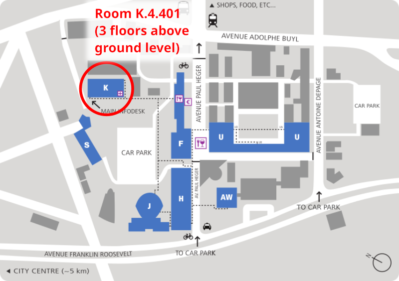

# Railways and Open Transport devroom @ FOSDEM

This repository collects information and resources in the scope of the [Railways and Open Transport devroom](https://fosdem.org/2024/schedule/track/railways-and-open-transport/) at FOSDEM 2024. You are welcome to extend and improve it!

The hosts of this devroom are Cornelius Schumacher ([@cornelius](https://github.com/cornelius)), Loïc Hamelin ([@loic-hamelin](https://github.com/loic-hamelin)), Max Mehl ([@mxmehl](https://github.com/mxmehl)), Peter Keller and Simon Clavier ([@SimonClavier](https://github.com/SimonClavier)) as part of the wider OpenRail community.

## Call for Presentations

The [Call for Participation](2024-cfp.md) has ended and we reviewed many interesting proposals. Thanks for the many great proposals, it has been a hard choice!

## Attendee information

We composed an exciting programme for everyone interested railways, mapping, routing, ticketing, and connected topics:

**Date**: Saturday, 3 February 2024\
**Time**: 10:30 - 14:30 CET\
**Location**: Room K.4.401\
**Schedule**: See the [devroom's page](https://fosdem.org/2024/schedule/track/railways-and-open-transport/) or below

### How to get there?

The devroom will take place in **room K.4.401**. It is in the K building three floors above ground level:

You will find information about how to get to the venue [here](https://fosdem.org/2024/practical/transportation/).

## Speaker information

Timing:
* Please be in the devroom at least 5 minutes before the start of your talk so we can connect your equipment and wire you up.
* We will have to cut you off 5 minutes before the scheduled end of your talk to allow the audience to switch rooms and set up the next speaker.
* There is no fixed Q&A time, but we would appreciate if you planned some minutes for the audience to ask questions.
* Please note that FOSDEM hallways are very crowded and rooms sometimes hard to find, so plan for extra minutes to get from A to B.

Presentation:
* You don't have to send us your slides beforehand, but of course you can so we have them as back-up.
* Please use your own device to present. On-site you will typically find a HDMI cable and some adapters, but please bring your own adapter to be sure.
* The presentation can be in the typical 16:10 format and should also be readable in lower resolutions and from a larger distance.

## How can I contact you?

You can reach the devroom's coordinators via email: `railways-devroom-devroom-manager (at) fosdem.org`

The current coordinators are listed on the top of this file.
