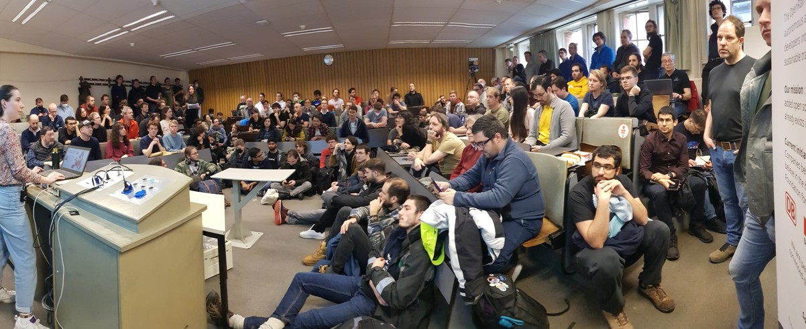

# Railways and Open Transport Devroom at FOSDEM 2026 - Call for Participation

We are excited to announce that for the fouth time in a row, there will be a **Railways and Open Transport devroom** at FOSDEM. Together, we will explore the space of Free and Open Source Software in the context of railways and public transport. See our previous editions in [2023](https://archive.fosdem.org/2023/schedule/track/railways_and_open_transport/), [2024](https://archive.fosdem.org/2024/schedule/track/railways-and-open-transport/) and [2025](https://archive.fosdem.org/2025/schedule/track/railways/).

We invite you to [participate](https://fosdem.org/submit) by presenting your work and projects in this space. We are primarily looking for 20 minutes presentations and also welcome short lightning talks. Please submit them at https://fosdem.org/submit.

Once again, this will be an excellent opportunity to show what you are doing and discuss it with like-minded people from the community.

> [!NOTE]
> [FOSDEM](https://fosdem.org) is Europe's largest gathering of Free and Open Source Software developers and enthusiasts, with thousands of people attending and hundreds of talks taking place each year. FOSDEM 2026 will happen on the weekend of 31 January and 1 February 2026 as an in-person event in Brussels, Belgium at the ULB university.

<figure>
  
  <figcaption>The Railways and Open Transport devroom was very-well visited</figcaption>
</figure>

## Key dates

For the Call for Presentations process:
* 30 November: CfP submission deadline
* 15 December: Announcement of selected talks
* 31 January: Railways and Open Transport devroom at FOSDEM, you must be available onsite to present your talk (tentatively 13:00-17:00 local time)

## Topics

We are interested in presentations on any topic related to Free and Open Source Software in the context of railways and public transport. Possible topics include:

* Railway infrastructure and operation: timetabling, signalling, operation, simulation, dispatching, infrastructure planning, network management
* Traveller information and accessibility: multimodal trip planning (train, bus, metro, ferry, air...), inclusion, open source ticketing, mobility as a service
* Analytics of railway and transport data: working with historical data, forecasts, machine learning, AI/AR
* Cross-cutting themes: international collaborations and open standards (e.g. NeTEx, SIRI, GTFS), climate and sustainability impact, gamification and education, policy

The audience is developers and enthusiasts of Free and Open Source Software. This includes a good number of railway fans and people active in related communities and organizations.

## Submission process

Please submit your proposals via the [FOSDEM's conference system](https://fosdem.org/submit). Make sure to select the "Railways and Open Transport" track and fill out all the information which is needed to describe your talk and all speakers. Deadline is 30 November 2025, 23:59 (Europe/Brussels, UTC+1).

Important notes:
* Your on-site availability is required, we do not accept remote presentations.
* Preferred talk length is 20 minutes including Q&A. We also welcome shorter talks. Please state the length of the talk in the submission notes.
* The conference language is English.
* The account from last year will work. If you still have accounts from FOSDEM editions before 2024, these won't work, please create new ones.
* Title, abstract and speaker information will be published on the FOSDEM conference web site if your proposal is accepted.

If you run into issues with your submission, please reach out to us so we can assist you. See below for contact details.

## Recordings

The talks are recorded on-site. Any recordings will be published under the same license as all FOSDEM content (CC-BY or CC-BY-SA). By submitting a proposal and agreeing to present in the Railways and Open Transport devroom, you give permission to be recorded.

## How can I contact you?

To reach the organizers of the devroom you can open a thread on our [discussion board](https://github.com/OpenRailAssociation/FOSDEM/discussions). Please do not hesitate to contact us if you have any inquiry or suggestion for the devroom.

Brede Dammen, Cornelius Schumacher, Felix Gündling, Loïc Hamelin, Max Mehl, Peter Keller, Simon Clavier, Tu-Tho Thai - Railways and Open Transport devroom co-organizers
