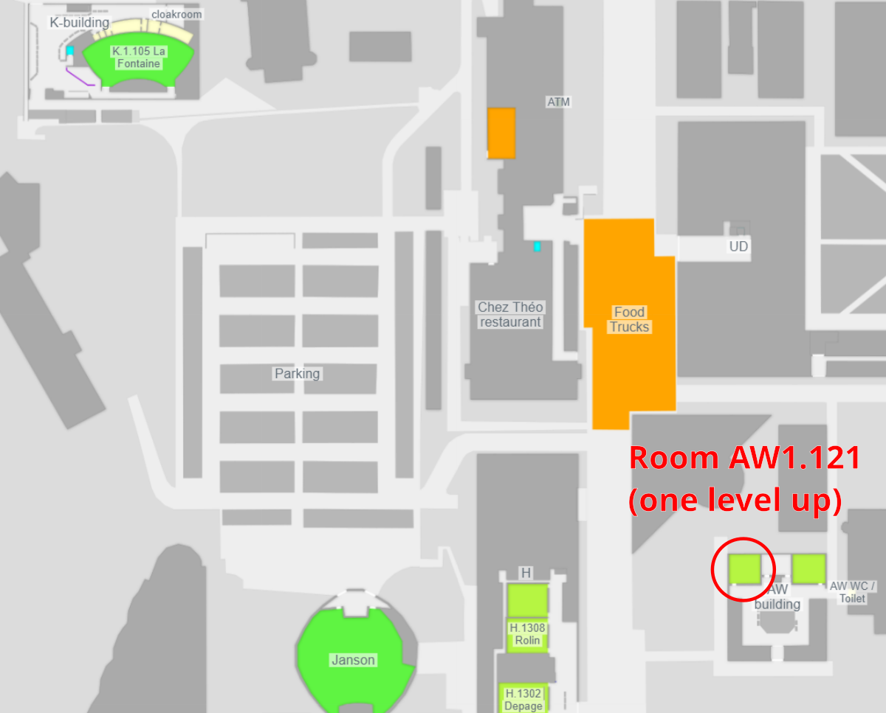

# Railways and Open Transport devroom @ FOSDEM

This repository collects information and resources in the scope of the [Railways and Open Transport devroom](https://fosdem.org/2023/schedule/track/railways_and_open_transport/) at FOSDEM 2023. You are welcome to extend and improve it!

## Attendee information

From the astonishing amount and quality of submissions, we have composed an exciting programme for everyone interested railways, mapping, routing, ticketing, and connected topics:

**Date**: Saturday, 4 February 2023\
**Time**: 10:30 - 14:30 CET\
**Location**: Room AW1.121 at ULB Bruxelles, Belgium\
**Schedule**: See the [devroom's page](https://fosdem.org/2023/schedule/track/railways_and_open_transport/)

### How to get there?

The devroom takes place in room **AW1.121**, which is in the AW building, 1 floor above ground level (bottom-right corner of the map below).

## Speaker information

Accepted speakers should receive information about organisational and technical details in advance by the FOSDEM organisers. We will also link/copy them here as soon as we receive them.

As a speaker in the devroom, at least one of the devroom organisers will be your personal contact, online and on-site. They will get in touch with you before FOSDEM via email.

## How can I contact you?

You can reach the devroom's coordinators via email: `transport-devroom-manager (at) fosdem.org`
