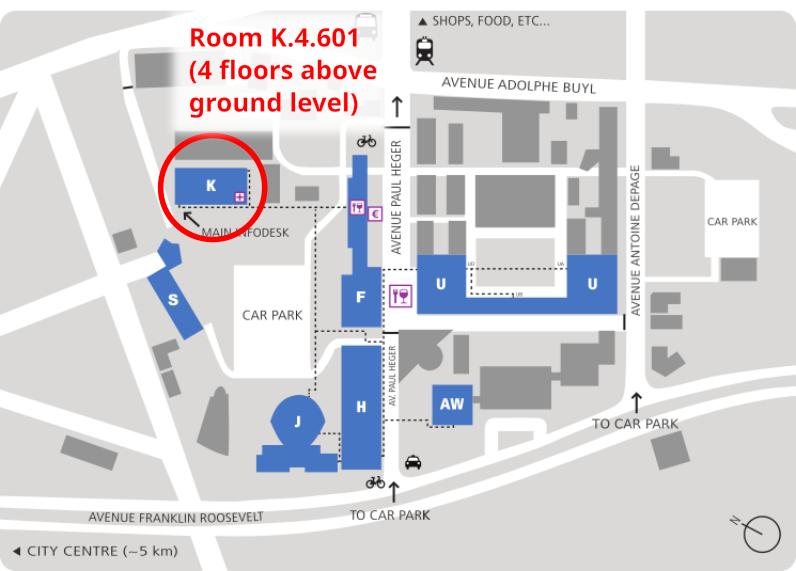

# Railways and Open Transport devroom @ FOSDEM

This repository collects information and resources in the scope of the [Railways and Open Transport devroom](https://fosdem.org/2026/schedule/track/railways-and-open-transport/) at FOSDEM 2026 (previous editions in [2023](https://archive.fosdem.org/2023/schedule/track/railways_and_open_transport/), [2024](https://archive.fosdem.org/2024/schedule/track/railways-and-open-transport/) and [2025](https://archive.fosdem.org/2025/schedule/track/railways/)). You are welcome to extend and improve it!

The hosts of this year's edition are:

* Brede Dammen ([@BredeD](https://github.com/BredeD))
* Cornelius Schumacher ([@cornelius](https://github.com/cornelius))
* Felix Gündling ([@felixguendling](https://github.com/felixguendling))
* Loïc Hamelin ([@loic-hamelin](https://github.com/loic-hamelin))
* Max Mehl ([@mxmehl](https://github.com/mxmehl))
* Peter Keller ([@KellerPeter](https://github.com/Keller-Peter))
* Simon Clavier ([@SimonClavier](https://github.com/SimonClavier))
* Tu-Tho Thai

## Call for Presentations

The [Call for Participation](2026-cfp.md) is open! We are looking forward to receiving your proposals for presentations. Deadline for submissions is 30 November 2025 23:59 CET.

## Attendee information

We composed an exciting program for everyone interested railways, mapping, routing, ticketing, and connected topics:

**Date**: Sunday, 31 January 2026\
**Time**: 13:00 - 17:00 CET (tentatively)\
**Location**: TBD\
**Schedule**: See the [devroom's page](https://fosdem.org/2026/schedule/track/railways-and-open-transport/)

### How to get there?

The devroom will take place in **room TBD**. It is in the TBD building TBD floors above ground level:

<!--  -->

You will find information about how to get to the venue [here](https://fosdem.org/2026/practical/transportation/).

## Speaker information

Timing:
* Please be in the devroom at least 5 minutes before the start of your talk so we can connect your equipment and wire you up.
* We will have to cut you off 5 minutes before the scheduled end of your talk to allow the audience to switch rooms and set up the next speaker.
* There is no fixed Q&A time, but we would appreciate if you planned some minutes for the audience to ask questions.
* Please note that FOSDEM hallways are very crowded and rooms sometimes hard to find, so plan for extra minutes to get from A to B.

Presentation:
* You don't have to send us your slides beforehand, but of course you can so we have them as back-up.
* Please use your own device to present. On-site you will typically find a HDMI cable and some adapters, but please bring your own adapter to be sure.
* The presentation can be in the typical 16:10 format and should also be readable in lower resolutions and from a larger distance.

## How can I contact you?

You can reach the devroom's organizers by starting a [discussion](https://github.com/OpenRailAssociation/FOSDEM/discussions) in this repository. Or look up one of the co-organizers and contact them directly. They are listed at the top of this file.
